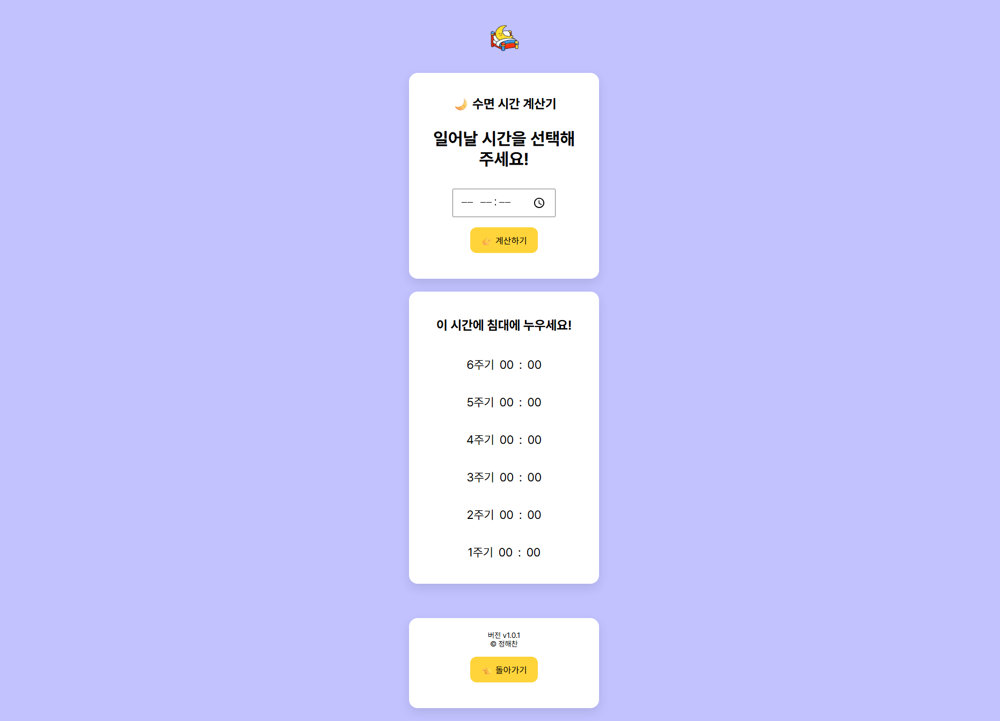

# haechan.xyz

- 여러 가지 재미있고 유용한 웹 서비스를 모아둔 **개인 프로젝트 사이트**입니다.
- 아이디어를 만들고 실험하는 공간

👉 https://haechan.xyz

---

## 서비스

### 🙋‍♂️ 일일넌센스
- **하루에 하나씩** 즐기는 넌센스퀴즈 입니다.
- 가볍게 웃고 갈 수 있는 1일 1넌센스퀴즈 서비스

👉 https://haechan.xyz/11quiz

---

### 🌙 수면 시간 계산기
- **침대에 누울 시간**을 계산해 드립니다.
- 수면 주기를 기준으로 6개의 시간을 제공

👉 https://haechan.xyz/sleeptime-calc

---

### ⏱️ 타이머
- **스톱워치와 타이머** 모드로 사용할 수 있는 전체 화면 시계입니다.

👉 https://haechan.xyz/timer

---

### 📖 블로그(티스토리)
- 배운 것, 여행한 것, 찍은 것, 생각한 것들을 **기록하는 공간**입니다.

👉 https://blog.haechan.xyz

---

### 📸 스크린샷
- 메인 페이지

- 일일넌센스

- 수면 시간 계산기

Font: Pertendard
_마지막 README 업데이트: 20260214_
